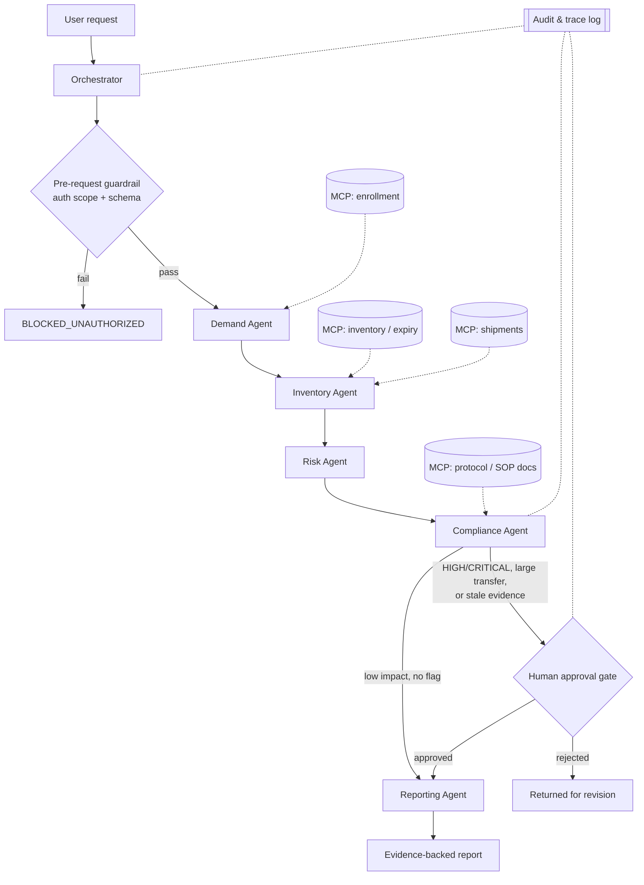

# CLAUDE.md

# Clinical Trial Stockout Risk Assessment Agent
## 1. Project Goal
Build a small, working Agentic AI prototype in VS Code using Claude Code.
The prototype identifies clinical trial sites at risk of investigational-product stockout within 30 days and recommends evidence-based replenishment actions.
Develop and validate the solution phase by phase; keep every phase runnable and tested.
## 2. Business Problem
Phase II and Phase III trials operate across multiple sites with uncertain enrollment, dropouts, protocol changes, expiry limits, and variable consumption.
Reactive planning can cause stockouts, delayed treatment, emergency shipments, excess inventory, wastage, and higher trial costs.
The prototype must answer: "Which sites are at risk within 30 days, why, and what action should a supply manager review?"

### 2.1 Organizational Objective
The organization wants to build an AI-driven Clinical Trial Supply Chain Platform that can:
- Predict site-level demand using enrollment forecasts.
- Optimize drug allocation across sites.
- Predict potential stockout situations.
- Monitor cold-chain shipments in real time.
- Recommend proactive replenishment plans.

### 2.2 GenAI / AI Opportunity
AI agents could:
- Analyze enrollment trends and predict future demand.
- Recommend optimal inventory levels for each site.
- Alert supply managers about potential shortages.
- Generate replenishment plans automatically.
- Provide conversational insights, for example: "Which sites are at risk of stockout in the next 30 days, and why?"

This prototype scopes the platform vision down to one agent: stockout risk assessment and replenishment recommendation. Demand prediction, cross-site allocation optimization, cold-chain monitoring, and conversational insight are the platform's fuller ambition (§2.1–2.2); the phases in §9 build toward that scope incrementally rather than all at once.
## 3. Users
### Primary
- Clinical Supply Manager: reviews risk and approves replenishment recommendations.
- Global Trial Supply Planner: monitors demand, inventory, and cross-site allocation.

### Secondary
- Clinical Operations Manager: reviews possible patient or study impact.
- Logistics Coordinator: checks shipment feasibility and delivery constraints.
- Quality/Compliance Reviewer: validates policy, evidence, and audit readiness.
## 4. Expected Outcome
For each assessed site, produce:
- Risk level: LOW, MEDIUM, HIGH, or CRITICAL.
- Estimated demand and days to stockout.
- Evidence used, source identifiers, and data timestamp.
- Recommended action and rationale.
- Confidence score, assumptions, and missing-data warnings.
- Guardrail result and human-approval status.

Example output:
```json
{
  "site_id": "IND001",
  "risk_level": "HIGH",
  "days_to_stockout": 18,
  "recommended_action": "Review shipment of 150 kits",
  "confidence_score": 0.92,
  "approval_required": true,
  "evidence_ids": ["inventory-IND001", "enrollment-IND001"]
}
```
## 5. Required Data and Documents
### Structured Data
- Study/site master: study ID, site ID, country, status.
- Enrollment: actual enrollment, recruitment trend, planned enrollment, dropout rate.
- Inventory: usable kits, quarantine stock, safety stock, expiry date, lot/batch.
- Treatment demand: dose, visit schedule, kit-per-patient assumptions.
- Shipment data: status, expected delivery date, quantity, temperature status.

### Documents
- Approved study protocol and amendments.
- Clinical supply plan.
- Inventory/replenishment SOPs.
- Temperature-excursion and escalation SOPs.

For the prototype, use versioned synthetic data only. Mark it clearly as synthetic.
## 6. Success Criteria
- End-to-end workflow completes for valid input and produces an evidence-backed result.
- Stockout classification accuracy is at least 90% on the labelled prototype test set.
- Demand forecast MAPE target is below 10% where actual outcomes exist.
- Every recommendation has evidence IDs, confidence, rationale, and timestamp.
- Guardrails block unauthorized actions and unsupported recommendations in all negative tests.
- HIGH/CRITICAL cases and large transfers cannot proceed without recorded approval.
- Unit and integration test pass rate is at least 95%.
- No secrets, direct identifiers, or unnecessary patient-level data appear in logs.
## 7. AI Boundaries
### Allowed
- Read approved, authorized prototype data.
- Calculate demand and inventory coverage.
- Assess and explain stockout risk.
- Recommend a replenishment action for human review.
- Summarize evidence and create a business report.

### Prohibited
- Modify ERP, IRT/RTSM, CTMS, inventory, or shipment records.
- Release, cancel, or authorize a shipment.
- Make patient-level treatment decisions.
- Override protocol, quality, regulatory, or access controls.
- Invent missing facts, conceal uncertainty, or cite unavailable evidence.
- Use data beyond the requesting user's authorized study scope.

If evidence is missing, conflicting, stale, or below the confidence threshold, return `INSUFFICIENT_EVIDENCE` and escalate to a human.
## 8. Technology and Coding Standards
- IDE: VS Code.
- AI coding assistant: Claude Code.
- Language: Python 3.11+.
- API: FastAPI; models and validation: Pydantic.
- State: SQLite for prototype persistence; JSON for fixtures.
- Tests: pytest; lint/format: Ruff.
- Use typed, modular code and deterministic calculations for critical business rules.
- Never hardcode credentials, tokens, patient data, or environment-specific paths.
- Pin dependencies and keep `.env` out of source control.
## 9. Phase-by-Phase Delivery
### Phase 1: Foundation
Create repository, API, Pydantic models, synthetic fixtures, and deterministic risk rules.

### Phase 2: Agents and Skills
Add Orchestrator, Demand, Inventory, Risk, and Compliance agents plus reusable skills.

### Phase 3: State and Memory
Persist request state, steps, evidence, approvals, and final output.

### Phase 4: Hooks and Guardrails
Add input validation, authorization simulation, output validation, approval gates, and audit hooks.

### Phase 5: MCP
Expose read-only prototype resources for enrollment, inventory, shipments, and documents through approved MCP servers.

### Phase 6: Human Approval
Pause HIGH/CRITICAL or high-impact recommendations and accept an explicit approve/reject decision.

### Phase 7: Quality and Operations
Complete workflow, failure, guardrail, evaluation, observability, and traceability tests.

Do not begin the next phase until the current phase runs, tests pass, and documentation is updated.
## 10. Architecture and Sub-agents
`User -> Orchestrator -> Demand Agent -> Inventory Agent -> Risk Agent -> Compliance Agent -> Approval Gate -> Report`



- Orchestrator: validates request, creates plan, delegates work, and controls state transitions.
- Demand Agent: calculates expected kit consumption from approved inputs.
- Inventory Agent: calculates usable stock, coverage, safety stock, and expiry exposure.
- Risk Agent: assigns risk using deterministic thresholds and creates a proposed action.
- Compliance Agent: checks evidence, permissions, boundaries, and approval requirements.
- Reporting Agent: produces the final concise business output from approved state only.

Agents must exchange structured Pydantic objects, not unstructured hidden assumptions.
## 11. Reusable Skills
- `demand_forecast`: calculate demand for the requested horizon.
- `inventory_analysis`: calculate usable inventory and coverage.
- `risk_assessment`: classify risk from documented rules.
- `recommendation_generation`: draft a reviewable action with rationale.
- `evidence_summary`: map claims to source IDs.
- `report_generation`: format approved results.

Each skill must declare inputs, outputs, validation rules, failure behavior, and tests.
## 12. Hooks
- Pre-request: validate schema, authorization scope, and required fields.
- Pre-tool: allowlist MCP tools and enforce read-only access.
- Post-tool: validate schema, provenance, timestamp, and null handling.
- Pre-output: verify evidence, confidence, approval, and prohibited-action rules.
- Audit: record execution step, agent, skill, tool, status, and error without sensitive data.
- Test: run Ruff and pytest before accepting a phase as complete.
## 13. MCP Integration
Use read-only MCP resources for:
- Enrollment and study data.
- Inventory and expiry data.
- Shipment status.
- Approved protocol and SOP documents.

MCP responses must include source ID, retrieval timestamp, schema version, and authorization context.
For the MVP, implement local mock MCP servers backed by synthetic fixtures; clearly label them as mocks.
## 14. State, Context, and Memory
Maintain one shared workflow state:
```json
{
  "request_id": "REQ-001",
  "study_id": "PH3-ONC-2027",
  "site_id": "IND001",
  "current_step": "risk_assessment",
  "plan": [],
  "agent_outputs": {},
  "evidence": [],
  "guardrail_results": [],
  "approval": {"status": "PENDING"},
  "final_status": "IN_PROGRESS"
}
```

- Short-term memory: request, plan, tool responses, intermediate outputs, errors, and approval state for one run.
- Long-term memory: versioned historical forecasts, outcomes, decisions, and approvals using non-sensitive identifiers.
- Context isolation: agents receive only the fields needed for their responsibility.
- Resume: a run may continue only from the last valid persisted state.
- Conflict rule: current approved source data overrides memory; log the conflict.
- Retention: follow configured retention rules; never store secrets or unnecessary PII.
## 15. Guardrails and AI Governance
- Apply least privilege, role-based access, data minimization, and read-only tool access.
- Require source attribution for material claims and calculations.
- Separate deterministic calculations from LLM-generated explanations.
- Record model/prompt version and accountable human decision maker.
- Do not infer risk from geography, demographics, or other protected characteristics.
- Treat outputs as decision support, not autonomous operational instructions.
- Require approval for HIGH/CRITICAL risk, possible patient impact, compliance concern, or transfer above the configured threshold.
## 16. Human-in-the-Loop
When approval is required, stop before final action and present evidence, recommendation, confidence, assumptions, and risk.
Record approver role, decision, reason, timestamp, and recommendation version.
A rejection must end the action path or return the workflow for revision; it must never be silently bypassed.
## 17. Complete Workflow Testing
Test at minimum:
1. Normal LOW-risk site.
2. HIGH-risk site requiring approval.
3. CRITICAL site with possible patient impact.
4. Missing enrollment or inventory data.
5. Conflicting MCP sources.
6. Stale or malformed tool response.
7. Unauthorized study/site request.
8. Prompt injection inside a document.
9. Attempted ERP or shipment modification.
10. MCP timeout, agent exception, and memory-resume scenario.
11. Approval, rejection, and missing-approval paths.
12. Duplicate request and idempotent replay.

Use unit tests for skills/rules, contract tests for MCP schemas, integration tests for agents, and end-to-end tests for the full trace.
## 18. Output Quality Evaluation
Evaluate against a labelled synthetic benchmark and a reviewer rubric:
- Correctness: calculations and risk label match expected results.
- Groundedness: every material claim maps to evidence.
- Completeness: required output fields are present.
- Relevance: recommendation addresses the requested site/horizon.
- Explainability: rationale and assumptions are clear.
- Calibration: confidence decreases when evidence is incomplete.
- Actionability: recommendation is specific but remains within AI boundaries.

Store automated scores and human-review outcomes with the run ID.
## 19. Failure Behavior
Fail closed for authorization, evidence, compliance, or approval failures.
Return a structured error containing code, safe message, failed step, retryability, and trace ID.
Never continue with guessed values after a tool failure.
Use bounded retries only for transient read failures; do not retry validation or authorization failures.
## 20. Observability
Capture per run:
- Trace/request ID, phase, agent, skill, and state transition.
- MCP/tool name, start/end time, latency, status, and sanitized error.
- Model name/version, prompt version, token usage, and response latency where available.
- Guardrail decisions, approval events, output-quality scores, and final status.
- Do not log secrets, full document contents, or patient-identifying data.
## 21. Traceability
Persist this lineage:
`User Request -> Plan -> Agent -> Skill -> MCP/Tool -> Evidence -> Calculation/Action -> Guardrail -> Human Approval -> Final Output`

Each final claim must reference evidence IDs and the agent/skill that produced it.
Each run must produce a machine-readable audit record and a human-readable trace summary.
## 22. Definition of Done
The prototype is done when all phases are implemented, the API runs locally, all mandatory Agentic AI components are demonstrated, tests meet the stated criteria, negative tests show blocked behavior, approval cannot be bypassed, and observability plus traceability artifacts are generated for a complete run.
